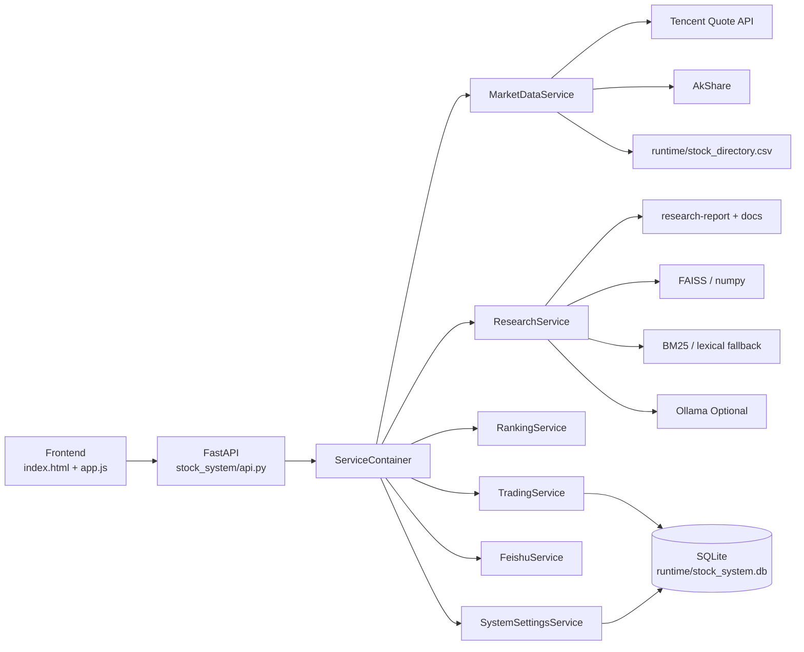

# Stock System RAG

一个面向演示与学习的股票智能系统，包含：

- 实时行情检索与股票搜索
- K 线历史数据与个股分析
- 本地 RAG（Embedding + BM25 + Rerank）
- 模拟交易（paper trading）与自动交易
- 飞书通知（Webhook / App）

项目目标是构建一条完整的“数据 -> 分析 -> 决策 -> 执行 -> 通知”链路，而不是直接用于实盘盈利。
在线查看：[`demo/effect.mp4`](./demo/effect.mp4)

## 1. 功能清单

### 市场与行情
- 股票代码/名称搜索
- 单股实时快照（腾讯行情优先，失败回退）
- 历史 K 线（日线，AkShare 优先，失败回退 demo 数据）
- 全市场分页行情

### 分析与推荐
- 多因子评分（动量、均值回归、质量、风险、新闻上下文）
- 推荐列表（支持多策略分数）
- 个股分析接口（返回打分、因子和解释）

### 研究问答（RAG）
- 文档切片：section-window-overlap
- 混合检索：Dense + Sparse(BM25) + RRF + Rerank
- 向量库：FAISS 优先，回退 numpy
- 检索模式：`hybrid` / `lexical`
- 可选 Ollama 生成式回答

### 交易
- 账户、持仓、订单管理（SQLite）
- 手动买卖（BUY/SELL）
- 自动交易（可选 RAG/Ollama 冲突裁决）
- live 模式保留抽象层，默认禁用

### 飞书
- Webhook 文本通知
- App ID/Secret 主动发消息
- 事件回调 `/feishu/events`（支持命令交互）

## 2. 技术栈

- 后端：FastAPI
- 前端：原生 HTML / CSS / JavaScript + ECharts
- 数据层：SQLite
- 数据分析：pandas / numpy / AkShare
- RAG：sentence-transformers / rank-bm25 / faiss-cpu（可降级）
- 通知：Feishu Open API
- 可选本地模型：Ollama

## 3. 系统架构



## 4. 项目结构

```text
stock/
├─ api_app.py                     # FastAPI 启动入口
├─ streamlit_app.py               # Streamlit UI（可选）
├─ frontend/
│  ├─ index.html
│  ├─ styles.css
│  └─ app.js
├─ stock_system/
│  ├─ api.py
│  ├─ container.py
│  ├─ config.py
│  ├─ db.py
│  ├─ schemas.py
│  └─ services/
│     ├─ market_data.py
│     ├─ ranking.py
│     ├─ research.py
│     ├─ trading.py
│     ├─ feishu.py
│     └─ system_settings.py
├─ docs/
├─ research-report/
├─ scripts/
├─ runtime/                       # 运行期数据（已 gitignore）
├─ .env                           # 本地私密配置（已 gitignore）
└─ .env.example                   # 配置模板
```

## 5. 环境部署

### 5.1 方式一：Conda（推荐）

```bash
conda create -n stock-system python=3.11 -y
conda activate stock-system
pip install -r requirements.txt
```

### 5.2 方式二：venv

```bash
python -m venv .venv
# Windows
.venv\Scripts\activate
# macOS/Linux
source .venv/bin/activate
pip install -r requirements.txt
```

## 6. 配置接口（环境变量）

1. 复制模板：

```bash
cp .env.example .env
```

2. 按需填写 `.env`：

| 变量 | 说明 |
|---|---|
| `APP_ENV` | 运行环境标识 |
| `PAPER_INITIAL_CASH` | 模拟账户初始资金 |
| `AUTO_TRADE_BUDGET_RATIO` | 自动交易预算占现金比例 |
| `OLLAMA_BASE_URL` | Ollama 服务地址 |
| `OLLAMA_MODEL` | Ollama 模型名（为空则不启用生成） |
| `RAG_EMBEDDING_MODEL` | 向量模型 |
| `RAG_RERANK_MODEL` | 重排模型 |
| `RAG_VECTOR_STORE` | `faiss` 或其他回退模式 |
| `FEISHU_WEBHOOK_URL` | 飞书机器人 webhook |
| `FEISHU_APP_ID` | 飞书应用 App ID |
| `FEISHU_APP_SECRET` | 飞书应用 Secret |
| `FEISHU_VERIFY_TOKEN` | 飞书事件回调校验 token |

## 7. 启动方式

### 7.1 启动后端 + 原生前端

```bash
uvicorn api_app:app --host 127.0.0.1 --port 8000 --reload
```

浏览器打开：`http://127.0.0.1:8000/`

### 7.2 启动 Streamlit（可选）

```bash
streamlit run streamlit_app.py
```

## 8. 主要 API

### 系统
- `GET /health`
- `GET /system/settings`
- `POST /system/settings`
- `GET /system/ollama/check`

### 行情
- `GET /stocks/search?q=600519`
- `GET /market/overview`
- `GET /market/realtime?q=&page=1&page_size=30`
- `GET /stocks/{symbol}/realtime`
- `GET /stocks/{symbol}/history`
- `GET /stocks/{symbol}/analysis`
- `GET /recommendations?limit=5&strategy=ensemble`

### 研究
- `POST /research/query`
- `GET /research/chunking`
- `GET /research/status`
- `POST /research/reindex`

### 交易
- `GET /accounts/paper`
- `GET /orders/paper`
- `POST /trade/order`
- `POST /trade/auto`

### 飞书
- `GET /feishu/status`
- `POST /notify/feishu/webhook`
- `POST /notify/feishu/app`
- `POST /feishu/events`

## 9. 飞书联调

详细步骤见：
- `docs/feishu-setup.md`

本地测试脚本：

```bash
python scripts/test_feishu.py --webhook --text "股票系统 webhook 测试"
python scripts/test_feishu.py --tenant-token
python scripts/test_feishu.py --app-send --receive-id <chat_id> --receive-id-type chat_id --text "hello"
```

## 10. 开源与安全说明

- `.env` 已加入 `.gitignore`，不会被提交到 Git。
- `runtime/`、`*.db`、本地虚拟环境目录也已忽略。
- 开源前请仅保留 `.env.example`，不要把真实 webhook/token/secret 推送到仓库。
- 若曾误提交密钥，请立即在服务侧轮换密钥并清理 Git 历史。

## 11. 常见问题

### Q1: AkShare 或外网不可用怎么办？
系统会回退到本地演示数据，保证页面与接口可用。

### Q2: RAG 依赖缺失怎么办？
会自动降级到词法检索，不会阻断主流程。

### Q3: 可以直接用于实盘吗？
当前版本以 `paper` 为主，`live` 默认禁用，仅保留扩展接口。

## 效果视频

- 在线查看：[`demo/effect.mp4`](./demo/effect.mp4)
- 如果网页内无法直接播放，点击链接后可在新页面播放或下载。

## 12. License

建议开源时补充 `LICENSE` 文件（如 MIT / Apache-2.0）。
