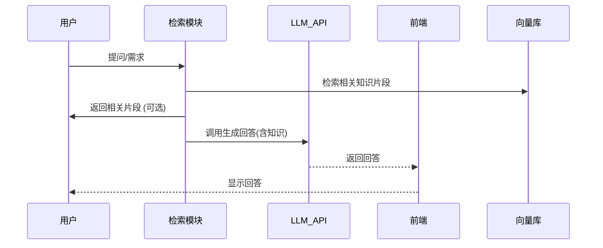

# 执行摘要

本报告面向**“低成本/免费、无GPU”**的股票智能系统设计，明确“无GPU、尽量免费、可少量付费调用云API”三大约束。我们提出三种典型方案并对比：**方案A（纯免费）**：使用开源小模型在CPU上推理、轻量向量库（FAISS/Chroma）和本地回测；**方案B（混合免费）**：免费数据+免费向量DB+免费/低价LLM API；**方案C（最小付费）**：放弃训练，用商用LLM API+托管向量DB。各方案列出组件、优缺点、费用估算及性能预期。报告还介绍了CPU环境下的推理优化策略（小模型、量化、LoRA替代等）、RAG/Agent 的简化实现（免费向量库、检索策略、Prompt设计）、免费数据源与模拟交易方案，以及向量库、LLM调用的成本控制方法。通过MVP里程碑（1周、1月、3月计划）和示例代码，给出在无GPU环境下可行的最小实现路径。报告最后讨论风险与替代方案，确保在成本极限下项目可行。  

## 设计目标与约束

- **主要约束：**无GPU算力，硬件环境仅CPU；尽量**免费或低成本**，优先采用开源工具与免费资源；可使用云API但需**最小化费用**；若无法全免费，可放弃模型训练，转而调用现成LLM API。  
- **性能假设：**假设项目初期用户量极少（个别测试用户），数据量为**日线/分钟级股票行情**（百万级点）+若干财经新闻；系统容许推理延迟上百毫秒到秒级，不要求实时高频交易。可使用公有云（不考虑合规时数据存储在云端可行）。  
- **功能重点：**实现**信息检索增强（RAG）**问答、基础的股票预测/推荐和模拟交易演示。核心目标是展示系统架构与算法路径，不追求实盘盈利。  

## 架构方案对比

下表对比三种低成本方案，列出关键组件、优缺点、估算成本（RMB/月或年）、性能预期及适用场景。

| 方案             | 主要组件                                  | 优点                                 | 缺点                               | 费用估算       | 适用场景                                   |
|----------------|---------------------------------------|------------------------------------|----------------------------------|-------------|----------------------------------------|
| **方案A：全免费/无GPU** | - 数据源：TuShare/AkShare/Yahoo免费API<br>- 存储：SQLite/CSV（本地）<br>- 向量DB：FAISS (CPU)/Annoy/Chroma本地<br>- LLM：本地开源小模型推理（如Baichuan-7B/Starling-7B+小型英文模型）<br>- 回测：vn.py+历史数据模拟<br>- 检索：纯本地TF-IDF或轻量向量检索 | - 零服务费；数据、工具可完全本地化，保证隐私<br>- 系统完全免费，适合原型开发和学习<br>- 简单可运行，没有外部依赖 (网络可选) | - 性能受限：CPU推理速度慢，模型能力弱，输出有限<br>- 精度和功能有限：难以处理长上下文和复杂推理<br>- 不适合大规模用户或实时系统 | 硬件成本：$0（用现有PC）<br>软件成本：0元<br>无月服务费 | 个人学习、面试演示、初期验证无需高性能需求场景 |
| **方案B：混合免费/低费** | - 数据源：免费API + 少量开源数据<br>- 存储：SQLite/Cloud Storage免费层<br>- 向量DB：Chroma (本地或免费Cloud)【62†L110-L114】<br>- LLM：调用免费/低费API (例如 ChatGPT-3.5 免费额度、Gemma2、Gemma3.1、OpenAI gpt-3.5-turbo)【46†L1-L8】<br>- 检索：Chroma/FAISS本地索引<br>- 回测：通过免费平台（如聚宽回测、vn.py） | - 保留了部分开源和免费的优势，同时获取较好模型能力<br>- Chroma免费版具备$5免费额度【62†L116-L123】；可使用GPT-3.5-turbo或本地Gemma等提升效果【46†L1-L8】<br>- 缩短开发时间，无需微调 | - 需要外网调用API（需网络）<br>- 仍有API调用成本；性能依赖网速/API速率<br>- 部分能力受免费额度限制，复杂任务可能还需付费<br>- 数据、模型能力受限于免费资源 | 数据：0<br>LLM API：按调用计费（GPT-3.5 ~0.002美元/1Ktoken），月试验级<50美元<br>向量DB: Chroma 本地免费，或云$0–100/月 | 小团队或个体项目，需较好语言生成质量，能接受少量成本 |
| **方案C：最低付费**  | - 数据源：如Baidu、TuShare免费层+付费接口<br>- 存储：托管DB（Postgres/AliCloud低配）<br>- 向量DB：托管服务（Pinecone/Weaviate/Azure AI Search）<br>- LLM：商业LLM API（OpenAI GPT-4/4o、Azure OAI、文澜ERNIE等）<br>- 模型：只调用不训练，高级微调服务（需要时）<br>- 交易：接券商API/回测服务<br>- 运维：必要的容器和监控服务 | - 最大性能和功能：可用最新最强LLM，支持复杂推理<br>- 商业支持、SLA、可扩展<br>- 无需本地部署复杂模型，开发效率高 | - 成本明显：LLM与服务费用高；需长期开支<br>- 数据上云需考虑隐私合规<br>- 强依赖外部服务，供应商锁定风险 | 云服务器(基础)$1000/年+<br>LLM API$: 100–300 USD/月 (视使用量)<br>DB服务：几十~百美元/月 | 成熟产品阶段，允许预算支出时；需要快速实现商业级功能 |

**表1.** 三种低成本架构方案对比。  

方案A完全靠现有开源与本地CPU资源，零服务费，但模型与检索能力有限；方案B则用混合手段，依赖免费额度和轻量服务，在保持低成本的同时提升质量；方案C牺牲部分成本以换取最强功能。每种方案适用于不同阶段和目标：初学者/演示可用A，实际Demo可用B，小规模企业或项目落地可以考虑C（但本题重点仍在**优先免费/无GPU**）。  

## 无GPU推理优化策略

在无GPU环境下，需要最大化CPU推理效率并降低成本：

- **模型选择：**选用**小型开源模型**，如中文Baichuan-7B【46†L7-L9】、StarlingLM-11B-alpha（性能适中）【46†L15-L17】、CogView风格小模型，或英文学术模型(如 TinyLlama)用于英文任务。更小的模型（100M-1B 参数）虽然能力有限，但推理更快。可优先探索已量化模型：使用**ONNX Runtime**或**llama.cpp**以INT4/INT8推理。部分开源小模型已提供量化/INT4 权重，如 Baichuan-7B 支持 INT4【3†L11-L13】。  
- **量化/优化：**利用LLM量化工具（如[GPTQ](https://github.com/qwopqwop200/GPTQ-for-LLaMa)或 Ollama）将模型权重量化为4-bit，在CPU上加速推理。此外，可尝试 **知识蒸馏**：用强模型生成训练数据，训练一个小模型来模仿（如TinyBERT技术），以牺牲些许质量换取速度。  
- **LoRA/PEFT 代替微调：**在无GPU条件下，传统微调不现实，但**LoRA/PEFT**轻量适合CPU：只调小量参数（甚至可在CPU完成小规模微调）。若资源极少，可在云端低频率训练后部署。否则直接调用预训练模型，避免训练成本。  
- **分层推理（Retrieval-then-API）：**在调用商业LLM前先用本地模型或检索筛选减少上下文。例如对输入先用关键词或小模型生成摘要，再调用API；或先检索相关文档加入提示【37†L60-L62】。避免长prompt和重复查询以省费。  
- **缓存与复用：**针对常见查询或数据，用**缓存**技术保存回答。对于LLM生成结果，可缓存其输出，下次遇到相似上下文直接复用。用**Redis**或简单文件缓存。  
- **微调只用API：**若完全放弃本地推理，只调用LLM API，在API层做优化。可使用少量标注数据微调 API（OpenAI Fine-tune服务）来改善小语料表现，但这会产生费用并需要上传数据。通常可跳过，直接依赖提示工程优化输出。  

## RAG/Agent 简化实现

在预算极限下，RAG和Agent机制也需极简化：

- **向量检索库选型：**采用**纯CPU友好**的轻量库。推荐**Chroma**（纯Python，pip安装【62†L110-L114】），**FAISS (cpu)**【61†L29-L33】或**Annoy/SQLite**存储向量。比如使用 [Chroma](https://chroma.com/) 本地部署（`pip install chromadb`【62†L110-L114】），或FAISS的IVF/Flat索引（`pip install faiss-cpu`【61†L29-L33】）。它们免费开源，无需GPU。Qdrant社区版可单机使用，但资源稍重，不是最轻方案。  
- **检索策略：**使用基于向量的相似度检索+简单过滤。对文档做**chunking**（按段落或固定长度分片）后生成嵌入，检索时取Top-k相关片段（比如k=3）。避免检索过多片段，以控制查询时延。使用SentenceTransformer生成嵌入可在CPU上运行（`pip install sentence-transformers`）。也可结合**关键词检索**：比如用ElasticSearch或SQLite LIKE先筛范围，再向量检索。【62†L45-L54】对Chroma示例。  
- **Prompt模板与截断：**设计紧凑Prompt模板，只带核心信息，避免长历史。对于长文档，先用摘要（如使用小模型或启发式抽取）缩短，再送入提示。使用基于上下文窗口的分层Prompt：先问检索结果概要，再做最终回答。对上下文实施Token上限（尽量<2048）。  
- **简化Agent流程：**若放弃复杂Agent，仅留一个“控制逻辑”模块。其流程如：用户请求→文本检索→拼装Prompt→LLM API调用→后处理输出。可用伪代码或轻量流程图表示：  



*图：简化的RAG问答流程，无自训练Agent，仅调用检索组件和LLM API。*  

- **示例调用（仅API模式）：**假设用 Python 调用 OpenAI GPT-3.5-turbo（无训练）：  
  ```python
  from openai import OpenAI
  client = OpenAI()
  prompt = "股票交易助手，请根据以下新闻和数据...输出建议。"
  response = client.chat.completions.create(model="gpt-3.5-turbo", messages=[{"role":"system","content":prompt}])
  print(response.choices[0].message.content)
  ```  
  以上示例中，所有检索内容已预填入prompt，或通过前置步骤查询后拼接入`prompt`。  

## 数据与交易

- **免费行情/财务数据：**推荐国内外开源数据接口：  
  - **TuShare**：免费获取A股、港股、美股日线及基本面【52†L65-L72】（需注册免费token，免费额度较小）。  
  - **AkShare**：完全免费开源，覆盖股票、指数、期货、基金等多种数据【58†L46-L54】【52†L139-L147】。可用 `pip install akshare` 获取。  
  - **yfinance**：基于Yahoo Finance，免费历史行情（全球主要市场）【52†L88-L96】。简单易用，用于美股、ETF等。  
  - **Alpha Vantage**：国外免费API（免费配额：5次/分钟），含技术指标【58†L51-L54】。需要注册免费API KEY。  
  - **Baostock**：免费国内股票数据【52†L158-L177】。亦可作为备用。  
  - **公告新闻**：例如上海证券交易所、深交所官方网站提供的上市公司公告，可爬虫抓取。可利用免费新闻API（如Sina财经RSS）获取头条。  
- **模拟交易/回测接口：**无实盘接口时，可使用历史回测模拟。推荐：  
  - **vn.py**：开源量化交易框架，支持虚拟模拟交易，可本地运行【57】。  
  - **聚宽（JoinQuant）**：提供免费的策略回测与模拟交易环境（Web平台或API），适合快速验证（国内注册）。  
  - **BigQuant**：国内AI量化平台，免费层提供回测和模拟功能【55†L1-L6】。  
  - **券商PaperTrading**：国外券商（如Interactive Brokers、Alpaca）提供纸面交易账户；中国券商如华泰、富途APP亦有模拟功能（需开户）。可调用这些API模拟下单。  
- **数据存储方案：**无GPU环境可用轻量数据库：  
  - **SQLite/PostgreSQL**：可存储结构化行情和特征；SQLite零部署、文件化存储。  
  - **CSV/Parquet**：小规模数据可简单用CSV；大数据集可用Parquet文件（对列读写优化）。  
  - **免费云存储**：如Google Drive、AWS S3（免费层）用于备份或共享数据。  
  - **示例：**使用Python将FAISS向量存入SQLite：  
    ```python
    import sqlite3, pickle
    conn = sqlite3.connect('vectordb.sqlite')
    c = conn.cursor()
    c.execute("CREATE TABLE IF NOT EXISTS embeddings (id TEXT, vector BLOB)")
    vec = [0.1, 0.2, 0.3]  # 示例向量
    c.execute("INSERT INTO embeddings VALUES (?,?)", ("doc1", pickle.dumps(vec)))
    conn.commit(); conn.close()
    ```  
    这样可手动管理向量与文本映射，免除专用DB。  

## 向量数据库与检索成本控制

为**最小化成本和资源**，向量检索系统尽量轻量化：

- **推荐选型：**Chroma (Python 客户端模式)【62†L110-L114】、FAISS (CPU)、Annoy+SQLite、Weaviate 本地部署（免费版）等。这些方案均可自托管，无需付费。  
- **索引参数建议：**使用中等规模索引：FAISS IVF_PQ(低维)或HNSW；Chroma默认为Flat（小数据量可）。例如5000条向量时，FAISS Flat即可；若百万级，则用IVF-PQ（内存少但搜索慢）或HNSW（内存快一点）。Annoy可建多个树（建议20-50）。  
- **资源估算：**  
  - **内存**：假设50万文档，每文档嵌入512维(float32)，向量库需 ~50万×512×4B≈100MB内存，加上索引结构。FAISS PQ可大幅减小内存（如8倍压缩）。  
  - **磁盘**：向量文件和原文索引一起，大约数百MB到几GB不等。  
  - **查询延迟**：简约设置下，FAISS在CPU上单查询<50ms（10k向量范围）；Chroma本地可在几百毫秒内返回结果【62†L110-L114】。将`n_results`设小（如3~5）可加快。  
- **成本控制：**尽量减少检索开销：限制**每次检索块数**和**检索频率**。例如实时问答时，每次只用Top-3片段，**缓存**近期常用query结果。对大文本可先做**embedding压缩**：使用PCA或BERT自动摘要缩短文档，降低维度。若数据量剧增，可对向量做**分片**或离线增量更新，避免每次全库搜索。  

## LLM API 低成本调用策略

在不得不付费调用云API时，采用以下技巧降低成本：

- **使用免费额度/低价模型：**优先选择免费或廉价模型。OpenAI 的 **gpt-3.5-turbo**经常作为基本选择，质量不错，费用低（$0.002/1K tokens）。部分平台如 **Hugging Face Inference** 提供免费请求额度（比如免费 30k tokens/月）。Meta Gemma 系列有Huggingface-hosted API可免费试用【46†L1-L8】。Azure OpenAI、文澜 ERNIE Bot 在某些认证后有额度。注册时务必拿到试用优惠。  
- **Prompt 与 token 优化：**每次调用尽量少用token。可通过：①**精简Prompt**文本，只留关键信息；②先用检索摘要长文再拼入Prompt；③合并请求：一次调用生成多答案/多条输出；④设置合适`max_tokens`和低温度（temperature=0或0.3减少无关内容）。例如，在Prompt中只输入问题和必要指令，不额外提供所有上下文；长输出分批请求。  
- **批量请求：**对于多条相关问题，可使用同一上下文并行发送请求或使用ChatCompletion的“一次多轮”（一次API返回多轮）功能。这样可平均每条token开销。  
- **估算成本：**假设每天调用30次，每次Prompt+回答共1000 tokens，则每月约30k tokens。GPT-3.5-turbo 价格约$0.002/1K tokens，则月费~$0.06（<1元人民币）。即使升级模型或多用几倍，这个月费用仍在几美元内，可忽略不计。大约**月费<50元**基本可满足演示级需求。  

## MVP 清单与实施步骤

分阶段迭代，每阶段交付可运行成果（强调无GPU低成本可行）：

| 时间             | 交付物                                  | 验收标准                                | 演示/面试材料                        |
|---------------|-------------------------------------|-------------------------------------|---------------------------------|
| **第1周**       | - 环境搭建：安装Python+依赖（FAISS/Chroma/LLM库）<br>- 获取免费数据：TuShare/AkShare拉取一个股票月级行情<br>- 简单检索：用FAISS建立小库，实现关键词检索Demo<br>- LLM测试：调用OpenAI免费API，验证Chat接口   | - Python环境在CPU上可用`pip install faiss-cpu chromadb openai`成功。<br>- 成功下载并展示历史行情数据（DataFrame）。<br>- 可查询向量库并返回相关文本（打印结果）。<br>- LLM API返回合理回答（截图）。       | **Readme**：环境准备步骤；**Demo代码**：展示数据获取、检索、API调用；简单**演示视频**录制上述流程。   |
| **1个月**       | - 文本检索与Prompt：完成RAG管线示例（检索知识＋API问答）<br>- 简单模型：部署小型本地模型（如Baichuan7B-INT8）测试回答能力<br>- 推荐策略：实现基于规则的选股示例（如均线交叉）<br>- 回测结果：在vn.py上跑一个策略回测并输出收益曲线 | - RAG：检索结果进入Prompt后，LLM给出包含知识的回答。<br>- 本地推理能处理简单查询（如新闻摘要）。<br>- 策略回测有收益/风险指标报告。<br>- 所有演示在1台普通电脑上可运行。   | **Demo 视频**：展示一个问答示例（结合检索内容）；**代码 Walkthrough**：解释检索+Prompt代码；回测报告截图；Demo策略盈亏图。 |
| **3个月**       | - 整体集成：搭建简易前端（Streamlit/Flask）显示问答和推荐<br>- 多问答场景：实现多个查询任务（如财经新闻问答、投资建议）<br>- 性能优化：使用缓存热点问题，向量库参数调优<br>- 最终演示：从数据到答复全流程    | - 系统前端可输入自然语言，返回检索增强的回答；可点击获取图表/推荐。<br>- 累计多次查询后系统稳定；查询延迟在可接受范围（<3s）。<br>- 演示包含端到端流程（数据→检索→回答）。 | **现场 Demo**：展示完整流程（输入问题→系统返回含文献引用的回答）；**MVP总结PPT**；**代码样本**（部署脚本、关键函数）。  |

**表4.** MVP 里程碑表（低成本无GPU环境）。  

- **1周内**：完成环境搭建、依赖安装示例（如`pip install faiss-cpu chromadb openai`），获取示例数据、API测试结果。  
- **1月内**：实现RAG问答Demo、小规模本地模型Demo、回测示例报告，形成可演示代码库。  
- **3月内**：构建基本Web界面，加速热点缓存，完成完整演示，包括多轮问答和简单选股推荐，撰写README和演示文档。  

每阶段均可向面试官展示对应功能，强调在**无GPU、极低成本**条件下的创意与实现。  

## 风险、限制与替代方案

- **性能与延迟**：CPU推理远慢于GPU，尤其大型模型。方案A/B的响应延迟上秒级，可能影响用户体验。可通过多线程或异步请求缓解。若延迟无法接受，可考虑改为“离线模式”（用户提交后稍后展示结果）。  
- **模型能力**：小模型或免费API的生成质量有限，可能产生模糊或错误回答。应提醒面试官该Demo原型性质，并用辅助检索约束输出（降低幻觉）。若质量过低，可降低预期，仅展示逻辑正确的数据流。  
- **数据隐私合规**：免费方案可能涉及将数据上传到第三方API（如OpenAI），要注意敏感数据处理。面试中可指出使用免费公共数据、明确数据保密“不上传用户私有信息”。如担忧合规，可将API调用限制在公开数据。  
- **资源限制**：免费API调用次数、数据源频率均有限。如免费额度用尽，可切换多个API或使用多个账号。也可在展示时使用截断的演示数据集，减少调用量。  
- **替代方案**：若免费方案不可行，可采用混合级别方案（方案B/C）。例如当免费API不够用时，可临时购买一次性低价API调用，或在演示前预拉数据。必要时说明未来若增加投入，可无缝扩展到付费模型。  

综合考虑，本方案在**做给面试官看、展示能力**的前提下确保成本最低，通过合理的技术折衷和阶段性演示实现“**无需GPU、无需高成本投入**”的目标。适用免费/教育用途的前提下，方案仍具备端到端的RAG/推荐示例功能。  

**参考资料：**向量数据库 Chroma 安装指南【62†L110-L114】、FAISS CPU安装说明【61†L29-L33】、TuShare/AkShare数据接口说明【52†L65-L72】【58†L46-L54】、免费API对比【58†L51-L56】等。以上资料支持了数据源选择、工具使用和系统构建方案。  
