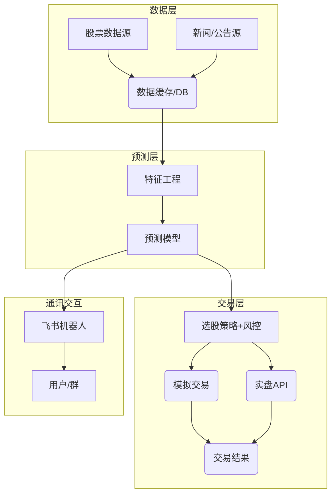
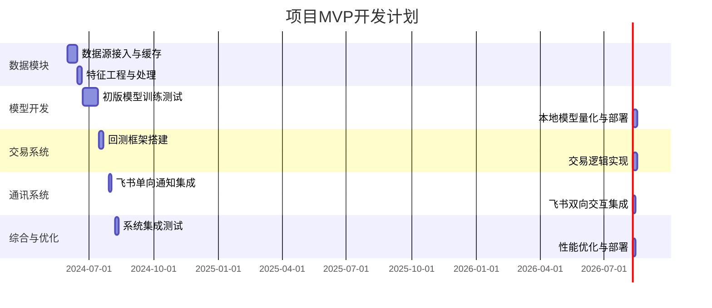

# 执行摘要  
本文全面规划一个基于股票的智能系统设计与实施方案，涵盖数据采集、模型预测、智能代理（Agent/RAG）、交易执行、通知接口、低成本部署以及项目展示与合规风险等八大模块。首先列出多种免费或低成本的中国A股数据源（如新浪、腾讯抓取接口、智兔、AkShare等）及其特点、API限额与合规风险，并示例性给出数据抓取与缓存伪代码。随后比较不同预测模型（RNN、Transformer、LightGBM、融合模型及基于检索增强生成的预测），介绍数据管道、特征工程、评估指标及回测框架，并说明在仅一台CPU+Ollama资源下可行的模型优化（蒸馏、量化或外部服务）方案。接着列出Agent/RAG/大模型/搜索推荐岗位常见技能需求，并用中文表格给出技能矩阵，说明本系统涉及的技能点及演示示例和常见面试问答要点。交易模块设计区分模拟与实盘流程，阐述执行流程、风控和仓位算法，并分析对接券商API的可行性与合规性（如中国《证券法》对程序化交易的要求【48†L1-L4】）。通知模块设计了基于飞书Webhook的一路通知与双向通讯机制，包括鉴权和重试策略。最后给出在有限资源下的MVP路线图、时间线（甘特图）及所需工具/成本估算，并建议项目展示材料结构（项目结构、Demo、README亮点、可量化指标、面试问题与答案）。同时指出数据、交易和模型等方面的合规与伦理风险及对应缓解建议。 

## 1) 数据获取与搜索  
- **免费/低成本数据源**：推荐使用国内源为主。示例包括：  
  - **智兔数服（Zhitu）**：支持沪深A股、港股、科创板等，无需注册免费调用【58†L38-L43】；  
  - **AkShare/Python库**：AkShare开源，覆盖实时/历史行情及财务数据（底层调用新浪、东财数据）【58†L71-L75】；Tushare需注册免费Token（200次/日），包含A股行情与财务指标【58†L71-L75】；Baostock专注A股，无需注册【58†L71-L75】；  
  - **Yahoo Finance**：全球市场历史数据，国内访问不稳定，调用频率上限约200次/分钟【6†L76-L80】；  
  - **新浪/腾讯接口**：新浪财经接口可抓取A股K线（只返回最近1023点【12†L137-L142】）；腾讯未公开接口可通过 `http://qt.gtimg.cn/q=sh600000` 等方式批量获取实时报价【14†L46-L54】。  
  - **聚合数据等平台**：如聚合数据A股实时限50次/日【58†L59-L63】；必盈200次/日免费。  
  - **iTick开源API**：涵盖A股、港美股、期货等，提供个人开发者免费套餐【62†L210-L214】。  
- **API限制与合规**：如Sina/Tencent接口为抓取方式，无官方授权，商用存在法律风险；Tushare有付费版解除调用限制；H5/爬虫需注意反爬频率。建议综合多源：开发时优先AkShare+智兔【58†L97-L100】，高频时多源并发（如新浪+腾讯）防止限流【58†L97-L100】。长期可考虑付费接口（同花顺、聚宽等）以确保合法合规。  
- **数据接入示例与缓存策略**：例如，可将API请求结果缓存到本地（文件、数据库或Redis），减少重复调用。伪代码示例：  
  ```python
  cache = {}  # 例如内存或持久化存储
  def get_kline(symbol, start_date, end_date):
      key = f"{symbol}_{start_date}_{end_date}"
      if key in cache:
          return cache[key]  # 缓存命中
      data = api_fetch(symbol, start_date, end_date)  # 调用股票API
      cache[key] = data  # 存入缓存
      return data
  ```  
  对于实时行情可设置TTL（如60秒）并使用轮询或WebSocket推送更新；对历史数据按天/周期缓存。**优先级**：免费开放源＞Python库（AkShare等）＞聚合数据免费额度＞商业API。  

## 2) 预测/推荐模块  
- **模型架构选项**：根据新闻、历史价格、财报等数据，可选用：  
  - **时序模型**：如LSTM/RNN或Transformer（如Time Series Transformer）用于价格序列预测；  
  - **提升树模型**：LightGBM/XGBoost可对特征（技术指标、财报因子、情绪得分等）进行回归/分类；  
  - **混合模型**：结合深度学习和机器学习，如用LSTM提取序列特征，再输入GBDT；或用神经网络提取文本情绪，结合表格数据。  
  - **RAG检索增强预测**：使用向量检索从新闻数据库获取相关文档，再结合LLM生成预测或报告。RAG可提升新闻知识利用，解决仅纯预测模型常见的信息遗漏问题。  
- **数据管道与特征工程**：建立ETL流程，定期从上节数据源提取数据并清洗。构造特征示例包括：历史价格的技术指标（均线、RSI、MACD等）、行业/市场板块因子、财报关键字段（市盈率、净利润增速等）、新闻情绪分数（通过分词、情感分析得分）等。文本特征可通过词袋/TF-IDF或预训练模型转为向量。  
- **评价指标**：回归可用MSE/MAE，分类可用准确率/F1。对交易策略需专用指标，如**IC (Information Coefficient)**、ICIR、RankIC评估因子预测能力；组合表现用**年化收益率(ARR)**、夏普/信息比(IR)、最大回撤(MDD)、卡玛比等【53†L11-L14】。  
- **回测与风控框架**：可使用开源库（Backtrader, Zipline, VectorBT, Qlib等）。回测流程：按时间模拟生成信号、择时下单、计算账户净值，记录各类交易数据。风控规则如：**止损止盈**（跌幅超过X%平仓）、**仓位限制**（单只股票仓位上限）、**风险敞口**（按VaR监控市场风险）等。可在策略中内置市值加权或波动率加权持仓算法，实现自动选股+配仓。例如：  
  ```python
  signals = model.predict(future_features)  # 预测信号
  top_stocks = select_stocks(signals, k=10)  # 取前N
  weights = allocate_portfolio(top_stocks, total_equity, method="volatility")  # 按波动率分配资金
  place_orders(weights)
  ```  
- **CPU+Ollama资源下原型**：由于资源受限，应选用小模型或优化：可**蒸馏**大模型到小模型（如DistilBERT），用低精度量化（8bit/4bit）以支持CPU推理；或利用Ollama等工具部署经过量化的LLaMA/ChatGLM等中小型模型（3B~7B参数）。对于文本生成，若本地推理太慢，可考虑调用外部API服务（如OpenAI）做辅助分析（注意合规和成本）。总体上，初期可用轻量模型+外部服务混合方式验证想法，再逐步优化本地部署方案。

## 3) Agent与RAG应用  
- **岗位技能矩阵**：招聘智能Agent/RAG/大模型/搜索推荐算法岗常考察多方面能力，具体可见下表（“✓”表示通常要求）：  

| 技能类别     | Agent/RAG工程师 | 大模型研发工程师 | 搜索/推荐算法工程师 |
|------------|---------------|----------------|-------------------|
| 自然语言处理   | 熟练（对话系统、Prompt工程） | 精通（Transformer、预训练模型） | 掌握（文本分析、分词）   |
| 检索与向量化   | 精通（向量检索、知识库构建） | 了解（特征嵌入）     | 精通（倒排索引、BM25/TF-IDF） |
| 机器学习算法   | 熟悉（分类回归、强化学习基础）| 精通（深度学习、生成模型）| 精通（排序算法、CTR模型）   |
| 数据工程与管道  | 熟悉（爬虫、数据库、ETL）    | 熟悉（大规模数据处理）  | 精通（大数据平台、SQL）    |
| 编程/工具    | Python, LangChain, VectorDB | Python, PyTorch, TensorFlow | Python, Spark, Elasticsearch |
| 系统架构    | 熟悉（微服务、REST API）   | 熟悉（容器化、MLOps）  | 精通（高并发系统、分布式） |
| 项目管理/沟通  | 理解（需求拆解、跨团队协作） | 理解               | 理解               |  

  本系统涉及技能：如使用LLM Agent或RAG需NLP和检索能力（如上表所列Agent/RAG行）；使用大模型时涉及模型微调和优化技巧；使用搜索推荐技术涉及数据管道和排序模型等。  
- **演示示例建议**：可准备几个演示场景：例如“股票智能问答Agent”——用户提问股票或行业情况，后台用RAG检索新闻后由本地LLM生成答案；“自动交易示例”——模拟场景下系统自动选股并发出买卖信号，通过可视化界面或日志展示；“Feishu机器人交互”——在飞书中与机器人对话获取行情提醒或信号。  
- **面试问答要点**：常见问题包括：如何定义LLM Agent及核心组件【57†L150-L158】？ReAct等多轮推理框架如何工作？如何设计RAG流水线（检索、构建知识库、生成回答）【57†L180-L188】？回答要点：举例说明检索策略、上下文拼接和LLM生成的衔接；强调检索缺失问题（未找回关键文档）【28†L59-L68】、答案不全面的原因及改进；突出使用多步检索、自动提问拆解等策略。针对搜索推荐，可讨论排序模型（CTR预估、排序回归）、A/B测试和评价指标等。总之，要结合项目展示中系统实现细节（如使用的工具、数据和模型）来回答，突出自己的工程思路和风险考量。  

## 4) 交易模块  
- **模拟交易设计**：基于回测框架（如Backtrader/Qlib），从信号生成到订单执行模拟完整流程：首先根据预测模块选股并决定买卖时机，然后生成“订单”（建仓/平仓指令）并在历史数据上模拟执行。订单执行考虑滑点、手续费等，更新持仓与资金。**风控规则**如：持仓上限、止损/止盈阈值（日内跌幅超过5%自动清仓）、总资金或杠杆限制等。资金管理可采用比例分配或等权策略。算法上，自动选股和配仓可示例为：  
  ```python
  signals = model.predict(features)            # 获得每只股票买入信号分数
  selected = np.argsort(signals)[-K:]         # 选出得分最高的K只
  weights = risk_parity_weights(selected)     # 计算配仓权重
  for stock, w in zip(selected, weights):
      place_order(stock, size=w*available_cash)
  ```  
- **实盘交易设计**：实盘与模拟流程类似，但订单通过券商API下达并实时监控。常见券商接口：如富途牛牛（Futu OpenAPI）、华盛通、易盛等。需注意A股交易规定：**T+1交割、不支持当天融券卖空**，以上新规也禁止融券T+0【49†L65-L69】；大额高频交易需提前申报【48†L1-L4】【49†L65-L69】。处理实际成交回报、挂单失败等，需要实现订单状态跟踪和重试逻辑。由于用户未指定券商，假设使用通用接口，重点设计接口调用抽象层即可。**订单管理**包括：跟踪未完成订单、撤单逻辑、成交回报处理等。**资金管理**：维护账户余额与买卖信号一致。自动交易按钮逻辑可以是“一键执行当前选股策略并下单”。例如：当用户点击“自动交易”，系统执行上述选股+下单流程，并发送Feishu通知确认。  
- **合规与风控**：项目默认中国A股市场，需遵守中国证券法规。根据《证券法》，程序化交易应满足监管要求并向交易所报告，不得扰乱市场秩序【48†L1-L4】；新规对**高频限制**（≥300笔/秒或日2万笔即为高频【49†L65-L69】）和禁止当日融券卖出【49†L65-L69】。因此，系统需避免超出这些阈值；若未指定券商，仅标注“券商未指定，需对接时再评估接口和资质”。同时，实施**止损/风控计划**，如触发最大回撤时强制平仓，确保实际运行安全。  


*上图为系统简化架构：数据层采集行情和新闻并缓存，预测层进行特征工程和模型推理，交易层执行选股/下单并在模拟或实盘中交易，同时Feishu机器人负责通知和交互。*

## 5) 通知与双向通讯  
- **单向通知（Webhook）**：在飞书群中添加自定义机器人，获得群聊Webhook URL，即可向群发送消息【32†L85-L88】。实现时只需POST JSON：`{"msg_type":"text","content":{"text": "推送内容"}}`到Webhook URL即可（示例代码见【32†L113-L120】【32†L130-L137】）。注意鉴权：群机器人URL本身含有签名，无需额外AppID/Secret。发送失败需重试，并确保遵守频率限制（约100次/分钟【32†L153-L157】）。  
- **双向通讯（App ID/Secret）**：创建飞书企业自建应用并开启机器人能力，获取`App ID`/`App Secret`【32†L78-L83】。通过调用`/auth/v3/tenant_access_token/internal`接口换取`tenant_access_token`。发送消息时使用飞书OpenAPI：向`/open-apis/im/v1/messages?receive_id_type=chat_id` POST消息体，包括`Authorization: Bearer {token}`头【36†L1318-L1327】【32†L78-L83】。消息格式同样为`receive_id`（用户ID或群ID）、`msg_type`、`content`的JSON。  
- **鉴权与安全**：应用收到来自飞书的事件（如用户@机器人）时，应校验`X-Lark-Signature`头以验证请求（计算方式见飞书文档【42†L118-L122】）。对于发出的消息，确保先获取并缓存好有效期内的`tenant_access_token`。  
- **重试与幂等性**：发送失败（如网络错）时可进行有限重试，避免批量消息冲击。Webhook或OpenAPI通常返回唯一ID，可利用此ID做幂等检查，确保重发不重复处理。飞书官方建议对调用结果检查`code`字段确认成功。  
- **示例交互流程**：用户在群聊中@机器人发起查询，飞书发送HTTP请求到后台；后台校验签名，解析消息，根据查询内容调用预测模块，然后用AccessToken通过API向用户或群组回复消息。伪码示例：  
  ```python
  # 飞书回调接收伪码
  sig = headers["X-Lark-Signature"]
  if not verify_signature(timestamp, nonce, body, encrypt_key): 
      return 403
  data = decrypt_if_needed(body, encrypt_key)
  user_query = data["event"]["text"]
  answer = run_query_agent(user_query)
  # 发送回复
  token = get_token(APP_ID, APP_SECRET)
  resp = requests.post("https://open.feishu.cn/open-apis/im/v1/messages",
                       params={"receive_id_type":"open_id"},
                       headers={"Authorization": f"Bearer {token}"},
                       json={
                          "receive_id": data["event"]["sender"]["sender_id"]["user_id"],
                          "msg_type": "text", 
                          "content": {"text": answer}
                       })
  ```  

## 6) 低成本实现方案与部署  
- **MVP路线图**：在1台普通CPU服务器上分阶段实施。初期搭建数据管道和简单模型，继而完善回测和通信模块，最后集成整个流程。下图给出一个示例甘特式时间线：  



- **所需工具/库**：数据获取可用`requests`、`akshare`等；数据处理用`pandas`、`numpy`；模型用`PyTorch`/`sklearn`；回测可用`backtrader`或`Qlib`；飞书通讯用`requests`或官方SDK。若使用Ollama，需安装其CL或Docker版。  
- **云/本地混合**：MVP可完全在本地服务器部署，若预算允许可将推理服务部署在云端容器以节省维护（如使用轻量服务器运行Docker）。数据存储可用SQLite或轻量数据库，若数据量大考虑云存储。  
- **成本估算**：  
  - 低档：全部自有硬件，用开源工具，无付费API（月成本近0，只考虑服务器电费）；
  - 中档：租用云服务器（1c2G ~30美元/月）+少量付费数据接口（如Tushare Pro ~年￥600）；
  - 高档：多台云服务器+高性能GPU（如用于大模型训练推理）+企业级数据服务，总成本可达数万元/年。  

| MVP任务                    | 预计用时 | 优先级 |
|---------------------------|--------|------|
| 数据源接入与缓存          | 2周     | 高   |
| 特征工程与数据清洗        | 1周     | 高   |
| 模型原型训练与评估        | 3周     | 高   |
| 回测框架搭建与策略验证    | 2周     | 高   |
| 交易执行与风控逻辑实现    | 2周     | 高   |
| 飞书通知与交互集成        | 1周     | 中   |
| 界面/演示脚本开发          | 1周     | 低   |
| 项目文档与演示准备        | 1周     | 中   |

## 7) 项目展示与面试材料  
- **项目结构**：建议模块化设计，如 `data/` (数据获取与缓存)、`features/` (特征计算)、`model/` (训练与预测)、`backtest/`、`trade/`、`bot/` (Feishu接口)、`docs/`。在README中说明系统功能模块、使用方法及依赖环境。  
- **演示与Demo**：制作关键演示视频或交互Demo，如实盘信号自动推送到飞书群、与机器人对话获取行情预测、回测结果的可视化图表等。确保这些demo直观展现系统核心功能和数据流。  
- **技术文档要点**：README需突出项目目标、架构图、环境依赖、运行步骤和API使用示例。文档中注明可复现的关键指标（如回测收益、准确率、系统延时等），并解释代码组织逻辑。可量化成果指标示例：策略年化收益率X%、预测准确率Y%、覆盖股票数目、系统延迟等。  
- **面试问答准备**：常见问题包括：系统如何保证数据合法与更新？如何选择模型与防止过拟合？风控细节是什么？如何保证系统稳定性与并发能力？可结合本项目细节（如缓存策略、模型评估过程、风控规则）作答。展示成熟思路：如提到风险控制措施、A/B测试，以及对业务的理解。  

## 8) 风险、合规与伦理  
- **数据合规**：确保使用的数据源符合授权要求。避免使用敏感或侵权内容；公开传播预测时应注明仅供参考，不构成投资建议。处理新闻文本时注意版权。若系统具有用户登录功能，要遵守用户隐私与信息安全规定。  
- **交易合规**：严格遵守中国证券法规：程序化交易必须向交易所报备【48†L1-L4】；禁止基于内幕消息交易；符合新规限制如高频阈值（300笔/秒、2万笔/日【49†L65-L69】）、禁止T+0融券【49†L65-L69】；确保不“操纵市场”。自动交易系统应配备**熔断/紧急暂停**机制，当异常（极端亏损、行情异常）触发时停机。  
- **模型风险**：市场非平稳性可能导致模型失效（策略失效、因子漂移等）。为缓解风险，可定期检验模型表现（如滑动窗口回测）并重训练；使用集成或多模型策略增加稳健性。避免过度拟合历史数据，保留验证集检验。监控模型输出是否出现异常（如过高置信），对LLM输出结果保持质疑，避免幻觉影响决策。  
- **伦理与解释性**：避免黑箱决策。使用后设置**人工审核**或在重要决策点提供解释，如显示主要驱动因子和新闻来源。若应用到用户，明确提醒风险并要求用户自行决策。尽量选择透明的模型（可解释的特征）并记录交易日志，确保事后可追踪。总之在设计上遵循**安全、可控、公平**原则，避免对市场造成系统性风险。  

**推荐阅读**：微软Qlib项目（量化回测及评估）【53†L11-L14】；飞书开放平台开发指南。各部分引用已注明主要信息来源，供深入研究参考。